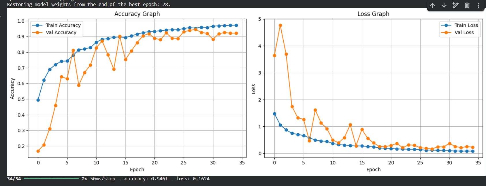
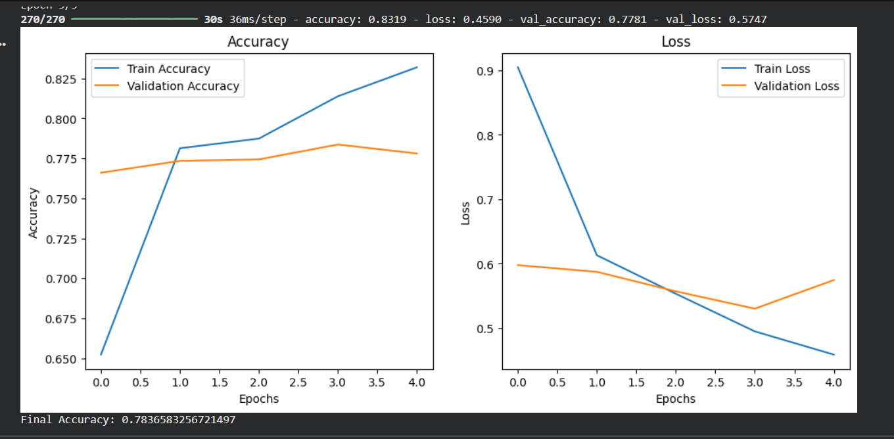
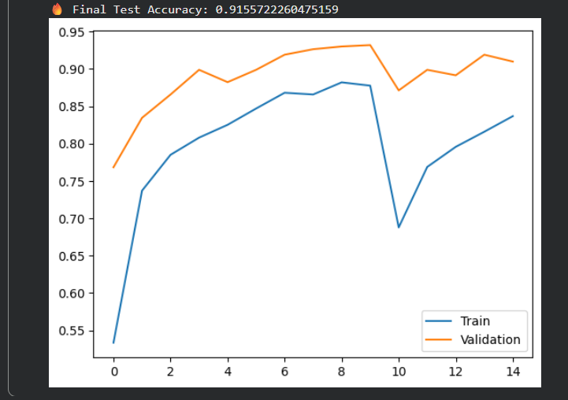

# Sugarcane Disease Detection

A Flask web application that detects sugarcane leaf disease from an uploaded image using a TensorFlow Lite model. The app shows the predicted class, confidence score, treatment guidance, prevention tips, fertilizer advice, and a dashboard of previous predictions stored in SQLite.

## Features

- Upload sugarcane leaf images through a browser UI
- Supports `jpg`, `jpeg`, `png`, and `webp` images
- Runs inference with `model/model_optimized.tflite`
- Displays prediction confidence and crop advisory information
- Saves prediction history to `data.db`
- Shows a dashboard with total predictions and disease distribution chart

## Disease Classes

The model output is mapped to these classes:

- Dried
- Healthy
- Mosaic
- RedRot
- Rust
- Yellow

Low-confidence predictions below `50%` are saved as `Unknown Disease`.

## Project Structure

```text
custom cnn/
|-- app.py
|-- data.db
|-- requirement.txt
|-- images/
|   |-- customcnn.png
|   |-- effcientnet80.png
|   `-- v2model.png
|-- model/
|   `-- model_optimized.tflite
|-- static/
|   |-- css/
|   |   `-- style.css
|   |-- js/
|   |   `-- main.js
|   `-- styles.css
`-- templates/
    |-- upload.html
    |-- result.html
    `-- dashboard.html
```

## Requirements

- Python 3.10 or newer recommended
- Flask
- TensorFlow
- Pillow
- NumPy

The Python dependencies are listed in `requirement.txt`.

## Model Comparison

This project compares the proposed Custom CNN model with transfer learning models such as MobileNetV2 and EfficientNetB0. The training results and accuracy graphs are shown below.

### Custom CNN



### MobileNetV2



### EfficientNetB0



### Training Summary

| Model | Epoch Setting | Early Stopping |
| --- | --- | --- |
| MobileNetV2 | 25 | Yes, patience=2 |
| EfficientNetB0 | 15, 10+5 | No, callbacks not used |
| Custom CNN | 40 | Yes, patience=7 |

The proposed Custom CNN model was trained for a maximum of 40 epochs using the Adam optimizer. Early Stopping with patience 7 was employed to prevent overfitting and restore the best-performing model weights. Therefore, the actual number of training epochs depended on validation accuracy improvement.

## Setup

1. Create and activate a virtual environment.

```powershell
python -m venv .venv
.\.venv\Scripts\Activate.ps1
```

2. Install dependencies.

```powershell
pip install -r requirement.txt
```

3. Make sure the model exists at:

```text
model/model_optimized.tflite
```

4. Run the Flask app.

```powershell
python app.py
```

5. Open the app in your browser.

```text
http://localhost:5000
```

## App Routes

| Route | Method | Description |
| --- | --- | --- |
| `/` | `GET` | Upload page |
| `/predict` | `POST` | Validates image, runs prediction, stores result, and shows advisory |
| `/dashboard` | `GET` | Shows prediction count and class distribution |

## How It Works

1. The user uploads a sugarcane leaf image.
2. The image is validated and resized to `224 x 224`.
3. The TensorFlow Lite model runs inference on the image.
4. The highest probability class is selected as the prediction.
5. The prediction and confidence score are saved in SQLite.
6. The result page shows the prediction, confidence meter, and advisory.
7. The dashboard reads saved predictions from `data.db` and renders a Chart.js pie chart.

## Database

The app uses SQLite and automatically creates this table if it does not already exist:

```sql
CREATE TABLE predictions (
    id INTEGER PRIMARY KEY AUTOINCREMENT,
    class TEXT,
    confidence REAL
);
```

Prediction history is stored in:

```text
data.db
```

## Troubleshooting

### Dashboard shows no data

Check that predictions exist in `data.db`. The dashboard reads from the `predictions` table and groups rows by class.

You can inspect the database with Python:

```powershell
python -c "import sqlite3; c=sqlite3.connect('data.db').cursor(); print(c.execute('SELECT class, COUNT(*) FROM predictions GROUP BY class').fetchall())"
```

### Model not found

If the app fails with `Model not found`, verify that the TFLite file is located here:

```text
model/model_optimized.tflite
```

### Image upload fails

Use a non-empty image file with one of these extensions:

```text
jpg, jpeg, png, webp
```

The maximum upload size is `5 MB`.

## Notes

- The model input size is configured as `224 x 224`.
- The app does not divide image pixels by `255` because the model is expected to contain its own rescaling layer.
- The model output is expected to already use softmax probabilities.
- Dashboard charts use Chart.js loaded from a CDN, so the dashboard chart needs internet access in the browser.
